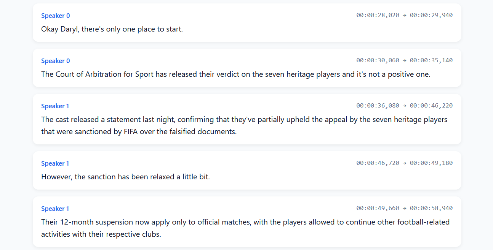

<h1 align="center">Speaker Diarization Using OpenAI Whisper</h1>

## Project Notes
This repository is based on the original `whisper-diarization` work.

## What is it
This repository combines Whisper ASR capabilities with Voice Activity Detection (VAD) and Speaker Embedding to identify the speaker for each sentence in the transcription generated by Whisper. First, the vocals are extracted from the audio to increase the speaker embedding accuracy, then the transcription is generated using Whisper, then the timestamps are corrected and aligned using `ctc-forced-aligner` to help minimize diarization error due to time shift. The audio is then passed into MarbleNet for VAD and segmentation to exclude silences, TitaNet is then used to extract speaker embeddings to identify the speaker for each segment, the result is then associated with the timestamps generated by `ctc-forced-aligner` to detect the speaker for each word based on timestamps and then realigned using punctuation models to compensate for minor time shifts.


Whisper and NeMo parameters are coded into diarize.py and helpers.py, I will add the CLI arguments to change them later
## Installation
Python >= `3.10` is needed, `3.9` will work but you'll need to manually install the requirements one by one.

`FFMPEG` and `Cython` are needed as prerequisites to install the requirements
```
pip install cython
```
or
```
sudo apt update && sudo apt install cython3
```
```
# on Ubuntu or Debian
sudo apt update && sudo apt install ffmpeg

# on Arch Linux
sudo pacman -S ffmpeg

# on MacOS using Homebrew (https://brew.sh/)
brew install ffmpeg

# on Windows using Chocolatey (https://chocolatey.org/)
choco install ffmpeg

# on Windows using Scoop (https://scoop.sh/)
scoop install ffmpeg

# on Windows using WinGet (https://github.com/microsoft/winget-cli)
winget install ffmpeg
```
```
pip install -c constraints.txt -r requirements.txt
```
## Usage 

```
python diarize.py -a AUDIO_FILE_NAME
```

## How To Execute `diarize.py`
1. Put your input audio file in the project (example: `audio/podcast.wav`).
2. Run the command:

```bash
python diarize.py -a audio/podcast.wav
```

Optional example with explicit device:

```bash
python diarize.py -a audio/podcast.wav --device cuda
```

Generated files will use the same basename as your input audio:
- `audio/podcast.html`
- `audio/podcast.srt`

By default, preprocessing is enabled (`demucs` + normalization flow) for better diarization quality. Use `--no-stem` if you want to skip source separation.

## Command Line Options

- `-a AUDIO_FILE_NAME`: The name of the audio file to be processed
- `--no-stem`: Disables source separation
- `--whisper-model`: The model to be used for ASR, default is `medium.en`
- `--suppress_numerals`: Transcribes numbers in their pronounced letters instead of digits, improves alignment accuracy
- `--device`: Choose which device to use, defaults to "cuda" if available
- `--language`: Manually select language, useful if language detection failed
- `--batch-size`: Batch size for batched inference, reduce if you run out of memory, set to 0 for non-batched inference
- `--remove_temp_result`: Remove temporary preprocessing output after execution
- `--diarizer`: Choose diarizer backend (currently `msdd`)

## Known Limitations
- Overlapping speakers are yet to be addressed, a possible approach would be to separate the audio file and isolate only one speaker, then feed it into the pipeline but this will need much more computation
- There might be some errors, please raise an issue if you encounter any.

## Future Improvements
- Implement a maximum length per sentence for SRT

## Result Example
Example output generated from `audio/podcast.wav`:
- HTML file: [`audio/podcast.html`](audio/podcast.html)
- SRT file: [`audio/podcast.srt`](audio/podcast.srt)

### HTML Output Preview


### SRT Output Example
```srt
6
00:00:28,020 --> 00:00:29,940
Speaker 0: Okay Daryl, there's only one place to start.

7
00:00:30,060 --> 00:00:35,140
Speaker 0: The Court of Arbitration for Sport has released their verdict on the seven heritage players and it's not a positive one.

8
00:00:36,080 --> 00:00:46,220
Speaker 1: The cast released a statement last night, confirming that they've partially upheld the appeal by the seven heritage players that were sanctioned by FIFA over the falsified documents.

9
00:00:46,720 --> 00:00:49,180
Speaker 1: However, the sanction has been relaxed a little bit.
```

## Citation

```bibtex
@unpublished{hassouna2024whisperdiarization,
  title={Whisper Diarization: Speaker Diarization Using OpenAI Whisper},
  author={Ashraf, Mahmoud},
  year={2024}
}
```
